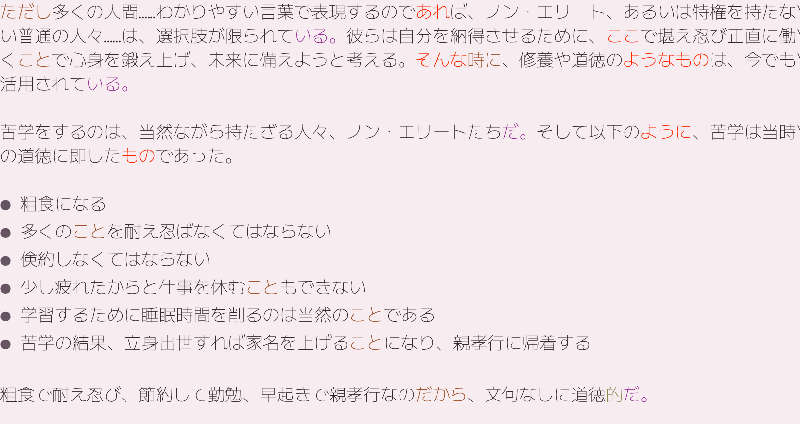

# 日本語文書作成支援ツール (nhg-minor-mode)

## はじめに

**nhg-minor-mode** は日本語文書の作成を支援するためのツールです。
「色で警告する」ことで次の3点を実現させます。

* 語尾の重複を避ける
* 受け身の多用を避ける
* 指示語の多用を避ける

日本語の表記ゆれや誤字の指摘などはしません。

## 設定方法

GitHub経由でインストールし、自動で読み込む設定（Elpaca + leaf / use-package）を推奨します。

### use-package の場合

```lisp
(use-package nhg-minor-mode
  :ensure (nhg-minor-mode
           :url "https://github.com/ichibeikatura/nhg-minor-mode")
  :hook ((text-mode markdown-mode) . nhg-minor-mode))

```

### leaf の場合

```lisp
(leaf nhg-minor-mode
  :elpaca (nhg-minor-mode
           :url "https://github.com/ichibeikatura/nhg-minor-mode")
  :hook ((text-mode-hook markdown-mode-hook) . nhg-minor-mode))

```

テキストファイルやMarkdownファイルを開くと `nhg-minor-mode` が動き出します。

## 使い方

* なにかを書く
* 自然に色が付く
* 色が多すぎる場合は確認する
* 直したい場所を修正する

この様な表示になります。



## 考え方

次の三点に着目して作られています。

* 文末で文章の印象が大きく変わる
* 助詞周辺に重要な言葉が置かれやすい
* 手書きとコンピュータを使った文書の作成は間違える場所が違う

同じ文末が続くと単調な文章になってしまうため、色を変えて指摘します。あえて全ての語尾は網羅していません。色が変化する語尾と、変化しない語尾のバランスを良くすると、自然になめらかな文章になるからです。

助詞というのは文章の要ですから、こちらも着色します。色が変わり助詞周辺が目に入ることによって、効率良く文章の微調整が可能となります。その他、多用されると違和感のある表現、コンピュータ特有のミスなども色を変えて表示します。

作成にあたって、参考にした論文は次のものです。

[http://ci.nii.ac.jp/naid/110003743558](http://ci.nii.ac.jp/naid/110003743558)

### なにもしないこと

nhg-minor-mode は色は変えますがなにもしません。

誤字の指摘を見ることと、書くという行為とは別の行為です。書くことに集中したい際には、自由に無視することができます。書いている途中で使いたくなれば、色を意識するだけで使えます。

あえて違和感のある表現をしたい場合には、押し付けがましいツールは邪魔でしかありませんが、このツールならば違和感のある表現を、意図的に書くために使用することも可能です。

この考え方をベースに、さらに使いやすいツールを自由に開発していただいて構いません。
